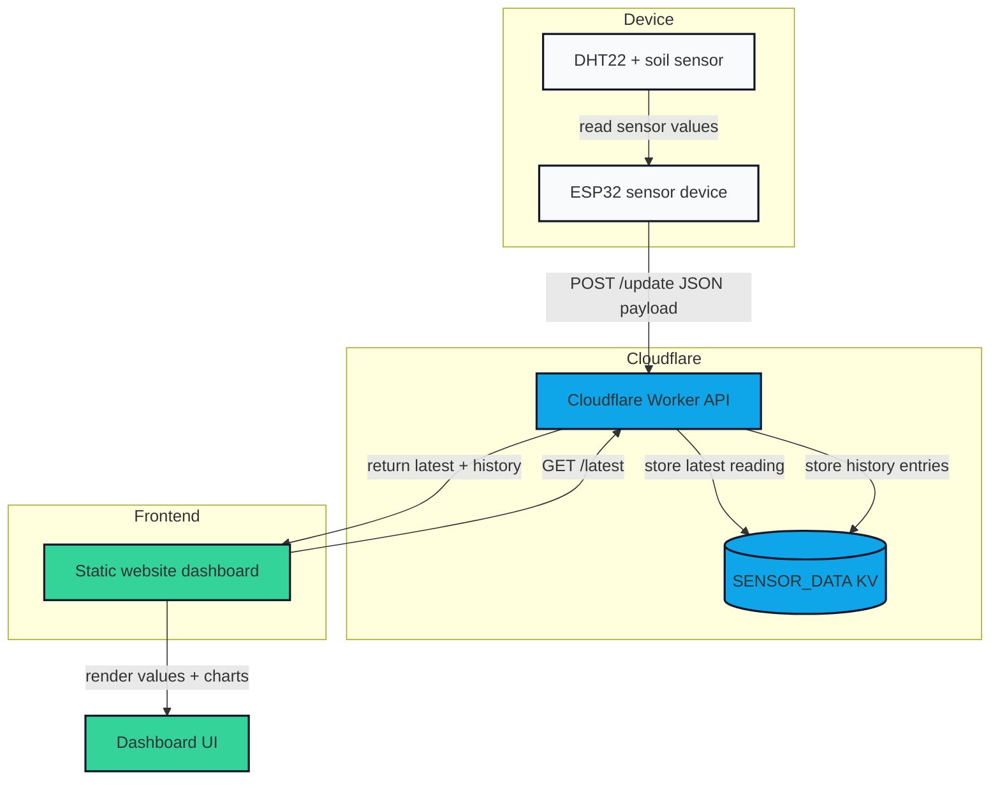

# Simple-IoT-Cloud-Website
UAS Cloud Computing

## Cloudflare Deployment

This project uses an ESP32 sensor sketch plus a static website hosted on Cloudflare Pages. Sensor data is sent from the ESP32 to a Cloudflare Worker API, and the website fetches the latest values from that API.

### Requirements

- Cloudflare account
- Cloudflare Pages site for the static frontend
- Cloudflare Worker for the API
- KV namespace named `SENSOR_DATA`

### Setup steps

1. Update `esp32/main.ino` with your Wi-Fi and Worker endpoint:
   - `WIFI_SSID`
   - `WIFI_PASSWORD`
   - `API_URL` (e.g. `https://<your-worker>.workers.dev/update`)

2. Deploy the Worker using `workers/worker.js`.
   - Bind a KV namespace named `SENSOR_DATA`.
   - In `wrangler.toml`, add the KV binding:
     ```toml
     kv_namespaces = [
       { binding = "SENSOR_DATA", id = "<your-kv-id>" }
     ]
     ```

3. Configure the Worker routes or use the Worker subdomain.
   - `POST /update` receives sensor data from the ESP32.
   - `GET /latest` returns the latest saved sensor data.

4. Deploy the static website from the `website/` folder to Cloudflare Pages.
   - Ensure `index.html`, `style.css`, and `app.js` are published.
   - Update `website/app.js` API URL to your Worker `GET /latest` endpoint.

5. Upload the ESP32 sketch.
   - Build and upload `esp32/main.ino` with the Wi-Fi and API settings.
   - Confirm the serial monitor shows successful Wi-Fi connection and POST responses.

### How it works

- ESP32 reads DHT22 and soil sensor data.
- ESP32 sends the latest measurements as JSON to the Cloudflare Worker.
- The Worker stores the latest reading and keeps the last 60 seconds of history in KV.
- The Cloudflare Pages website fetches `/latest`, displays the data, and renders a one-minute graph.

### Architecture diagram


